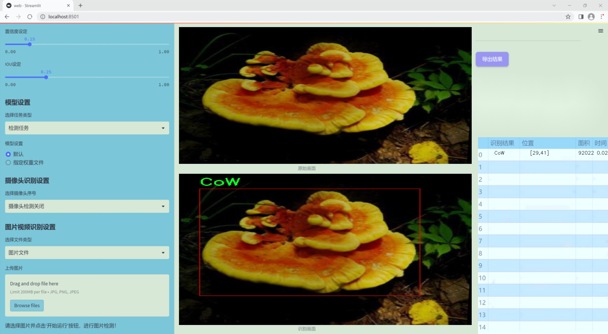
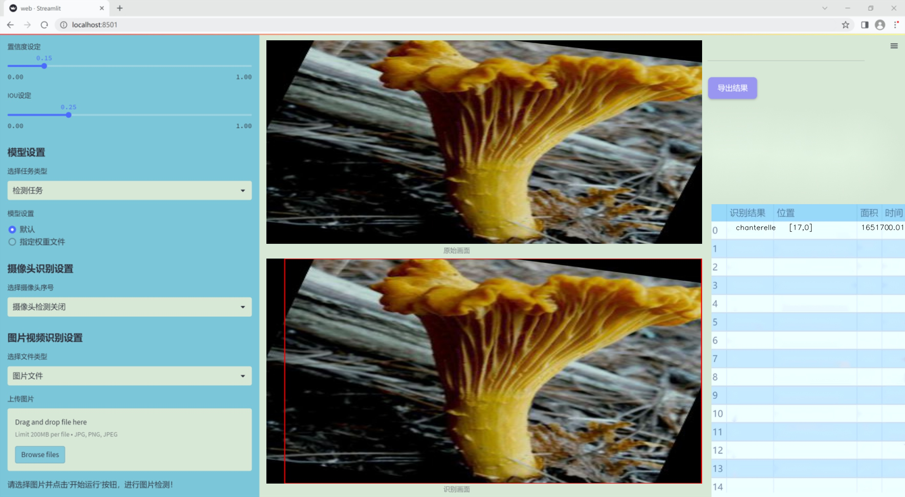
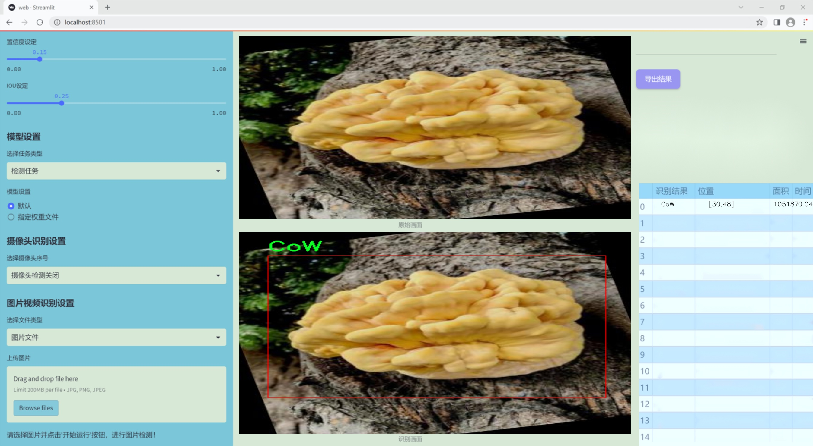
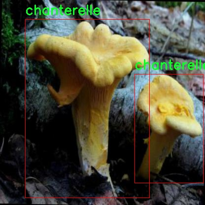
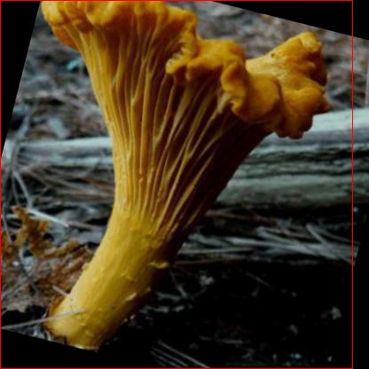
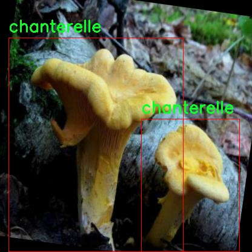
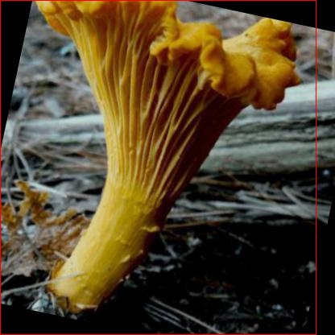
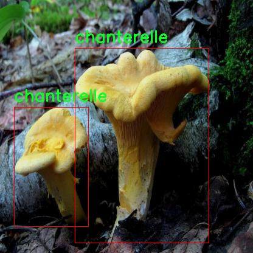

# 改进yolo11-DCNV2等200+全套创新点大全：蘑菇种类检测系统源码＆数据集全套

### 1.图片效果展示







##### 项目来源 **[人工智能促进会 2024.10.22](https://kdocs.cn/l/cszuIiCKVNis)**

##### 注意：由于项目一直在更新迭代，上面“1.图片效果展示”和“2.视频效果展示”展示的系统图片或者视频可能为老版本，新版本在老版本的基础上升级如下：（实际效果以升级的新版本为准）

  （1）适配了YOLOV11的“目标检测”模型和“实例分割”模型，通过加载相应的权重（.pt）文件即可自适应加载模型。

  （2）支持“图片识别”、“视频识别”、“摄像头实时识别”三种识别模式。

  （3）支持“图片识别”、“视频识别”、“摄像头实时识别”三种识别结果保存导出，解决手动导出（容易卡顿出现爆内存）存在的问题，识别完自动保存结果并导出到tempDir中。

  （4）支持Web前端系统中的标题、背景图等自定义修改。

  另外本项目提供训练的数据集和训练教程,暂不提供权重文件（best.pt）,需要您按照教程进行训练后实现图片演示和Web前端界面演示的效果。

### 2.视频效果展示

[2.1 视频效果展示](https://www.bilibili.com/video/BV1cEydY5EFd/)

### 3.背景

研究背景与意义

随着全球人口的不断增长和生态环境的变化，蘑菇作为一种重要的食用和药用资源，受到了越来越多的关注。蘑菇的种类繁多，营养丰富，但由于其外观相似性，很多人难以准确识别不同种类的蘑菇，这不仅影响了人们的食用安全，也对蘑菇的商业化种植和采集带来了挑战。因此，开发一种高效、准确的蘑菇种类检测系统显得尤为重要。

在这一背景下，基于改进YOLOv11的蘑菇种类检测系统应运而生。YOLO（You Only Look Once）系列模型以其快速的检测速度和较高的准确率在目标检测领域中取得了显著的成果。YOLOv11作为最新版本，进一步优化了模型的结构和算法，使其在处理复杂背景和小目标检测时表现更加出色。本项目旨在利用YOLOv11的优势，结合特定的蘑菇数据集，构建一个能够准确识别和分类蘑菇种类的智能系统。

本项目所使用的数据集包含51张关于美洲蘑菇的图像，涵盖了1个类别，即“CoW chanterelle”。尽管数据集规模相对较小，但通过数据增强和迁移学习等技术，可以有效提升模型的泛化能力和识别精度。该系统的实现不仅可以为蘑菇爱好者提供安全的食用指导，还可以为农业生产者提供科学的种植建议，推动蘑菇产业的可持续发展。

综上所述，基于改进YOLOv11的蘑菇种类检测系统的研究具有重要的现实意义和应用价值，不仅能够提升公众对蘑菇的认知与安全意识，还将为相关领域的研究和实践提供有力的技术支持。

### 4.数据集信息展示

##### 4.1 本项目数据集详细数据（类别数＆类别名）

nc: 2
names: ['CoW', 'chanterelle']


该项目为【目标检测】数据集，请在【训练教程和Web端加载模型教程（第三步）】这一步的时候按照【目标检测】部分的教程来训练

##### 4.2 本项目数据集信息介绍

本项目数据集信息介绍

本项目所使用的数据集名为“American Mushrooms”，旨在为改进YOLOv11的蘑菇种类检测系统提供基础数据支持。该数据集专注于两种特定的蘑菇类别，分别为“CoW”（牛肝菌）和“chanterelle”（鸡腿菇），共计包含两类样本。这一数据集的构建不仅考虑了蘑菇的多样性，还注重了其在自然环境中的真实表现，确保模型在实际应用中的有效性和准确性。

“American Mushrooms”数据集的样本来源广泛，涵盖了不同生长环境下的蘑菇图像，包括森林、草地及其他自然生态系统。每个类别的样本均经过精心挑选，确保图像质量高且具有代表性，能够有效反映出不同生长阶段和环境条件下蘑菇的特征。此外，数据集中还包含了丰富的标注信息，为模型的训练提供了必要的监督信号。这些标注不仅包括蘑菇的类别标签，还涵盖了其在图像中的位置，确保YOLOv11能够准确识别和定位目标物体。

在数据集的构建过程中，特别关注了样本的多样性和复杂性，以增强模型的泛化能力。通过引入不同的拍摄角度、光照条件以及背景环境，数据集力求模拟真实世界中可能遇到的各种情况，从而提高模型在实际应用中的鲁棒性。通过使用“American Mushrooms”数据集，我们期望能够有效提升YOLOv11在蘑菇种类检测任务中的性能，使其在生态研究、农业监测等领域发挥更大的作用。











### 5.全套项目环境部署视频教程（零基础手把手教学）

[5.1 所需软件PyCharm和Anaconda安装教程（第一步）](https://www.bilibili.com/video/BV1BoC1YCEKi/?spm_id_from=333.999.0.0&vd_source=bc9aec86d164b67a7004b996143742dc)


[5.2 安装Python虚拟环境创建和依赖库安装视频教程（第二步）](https://www.bilibili.com/video/BV1ZoC1YCEBw?spm_id_from=333.788.videopod.sections&vd_source=bc9aec86d164b67a7004b996143742dc)

### 6.改进YOLOv11训练教程和Web_UI前端加载模型教程（零基础手把手教学）

[6.1 改进YOLOv11训练教程和Web_UI前端加载模型教程（第三步）](https://www.bilibili.com/video/BV1BoC1YCEhR?spm_id_from=333.788.videopod.sections&vd_source=bc9aec86d164b67a7004b996143742dc)


按照上面的训练视频教程链接加载项目提供的数据集，运行train.py即可开始训练



     Epoch   gpu_mem       box       obj       cls    labels  img_size
     1/200     20.8G   0.01576   0.01955  0.007536        22      1280: 100%|██████████| 849/849 [14:42<00:00,  1.04s/it]
               Class     Images     Labels          P          R     mAP@.5 mAP@.5:.95: 100%|██████████| 213/213 [01:14<00:00,  2.87it/s]
                 all       3395      17314      0.994      0.957      0.0957      0.0843

     Epoch   gpu_mem       box       obj       cls    labels  img_size
     2/200     20.8G   0.01578   0.01923  0.007006        22      1280: 100%|██████████| 849/849 [14:44<00:00,  1.04s/it]
               Class     Images     Labels          P          R     mAP@.5 mAP@.5:.95: 100%|██████████| 213/213 [01:12<00:00,  2.95it/s]
                 all       3395      17314      0.996      0.956      0.0957      0.0845

     Epoch   gpu_mem       box       obj       cls    labels  img_size
     3/200     20.8G   0.01561    0.0191  0.006895        27      1280: 100%|██████████| 849/849 [10:56<00:00,  1.29it/s]
               Class     Images     Labels          P          R     mAP@.5 mAP@.5:.95: 100%|███████   | 187/213 [00:52<00:00,  4.04it/s]
                 all       3395      17314      0.996      0.957      0.0957      0.0845


###### [项目数据集下载链接](https://kdocs.cn/l/cszuIiCKVNis)

### 7.原始YOLOv11算法讲解


##### YOLO11介绍

Ultralytics YOLO11是一款尖端的、最先进的模型，它在之前YOLO版本成功的基础上进行了构建，并引入了新功能和改进，以进一步提升性能和灵活性。
**YOLO11设计快速、准确且易于使用，使其成为各种物体检测和跟踪、实例分割、图像分类以及姿态估计任务的绝佳选择。**


**结构图如下：**


##### **C3k2**

**C3k2，结构图如下**


**C3k2，继承自类`C2f，其中通过c3k设置False或者Ture来决定选择使用C3k还是`**Bottleneck


**实现代码** **ultralytics/nn/modules/block.py**

##### C2PSA介绍

**借鉴V10 PSA结构，实现了C2PSA和C2fPSA，最终选择了基于C2的C2PSA（可能涨点更好？）**


**实现代码** **ultralytics/nn/modules/block.py**

##### Detect介绍

**分类检测头引入了DWConv（更加轻量级，为后续二次创新提供了改进点），结构图如下（和V8的区别）：**


### 8.200+种全套改进YOLOV11创新点原理讲解

#### 8.1 200+种全套改进YOLOV11创新点原理讲解大全

由于篇幅限制，每个创新点的具体原理讲解就不全部展开，具体见下列网址中的改进模块对应项目的技术原理博客网址【Blog】（创新点均为模块化搭建，原理适配YOLOv5~YOLOv11等各种版本）

[改进模块技术原理博客【Blog】网址链接](https://gitee.com/qunmasj/good)


#### 8.2 精选部分改进YOLOV11创新点原理讲解

###### 这里节选部分改进创新点展开原理讲解(完整的改进原理见上图和[改进模块技术原理博客链接](https://gitee.com/qunmasj/good)【如果此小节的图加载失败可以通过CSDN或者Github搜索该博客的标题访问原始博客，原始博客图片显示正常】

### 可扩张残差（DWR）注意力模块
当前的许多工作直接采用多速率深度扩张卷积从一个输入特征图中同时捕获多尺度上下文信息，从而提高实时语义分割的特征提取效率。 然而，这种设计可能会因为结构和超参数的不合理而导致多尺度上下文信息的访问困难。 为了降低绘制多尺度上下文信息的难度，我们提出了一种高效的多尺度特征提取方法，该方法分解了原始的单步特征提取方法方法分为两个步骤，区域残差-语义残差。 在该方法中，多速率深度扩张卷积在特征提取中发挥更简单的作用：根据第一步提供的每个简明区域形式特征图，在第二步中使用一个所需的感受野执行简单的基于语义的形态过滤 一步，提高他们的效率。 此外，扩张率和扩张卷积的容量每个网络阶段都经过精心设计，以充分利用所有可以实现的区域形式的特征图。 因此，我们分别为高层和低层网络设计了一种新颖的扩张式残差（DWR）模块和简单倒置残差（SIR）模块。


首先，该博客引入了一个Dilation-wise Residual（DWR）模块，用于提取网络高层的特征，如图2a所示。多分支结构用于扩展感受野，其中每个分支采用不同空洞率的空洞深度卷积。
然后，专门设计了一个Simple Inverted Residual（SIR）模块来提取网络低层的特征，如图2b所示。该模块仅具有3×3的微小感受野，但使用inverted bottleneck式结构来扩展通道数量，确保更强的特征提取能力。
最后，基于DWR和SIR模块，构建了一个编码器-解码器风格的网络DWRSeg，其中解码器采用了简单的类似FCN的结构。解码器使用来自最后两个阶段的强语义信息直接对特征图进行上采样，然后将它们与来自较低阶段的特征图（包含丰富的详细信息）拼接起来，以进行最终预测。


### 9.系统功能展示

图9.1.系统支持检测结果表格显示

  图9.2.系统支持置信度和IOU阈值手动调节

  图9.3.系统支持自定义加载权重文件best.pt(需要你通过步骤5中训练获得)

  图9.4.系统支持摄像头实时识别

  图9.5.系统支持图片识别

  图9.6.系统支持视频识别

  图9.7.系统支持识别结果文件自动保存

  图9.8.系统支持Excel导出检测结果数据


### 10. YOLOv11核心改进源码讲解

#### 10.1 hcfnet.py

以下是对给定代码的核心部分进行分析和详细注释的结果：

```python
import math
import torch
import torch.nn as nn
import torch.nn.functional as F

# 定义空间注意力模块
class SpatialAttentionModule(nn.Module):
    def __init__(self):
        super(SpatialAttentionModule, self).__init__()
        # 2通道输入，1通道输出的卷积层
        self.conv2d = nn.Conv2d(in_channels=2, out_channels=1, kernel_size=7, stride=1, padding=3)
        self.sigmoid = nn.Sigmoid()  # Sigmoid激活函数

    def forward(self, x):
        # 计算输入的平均值和最大值
        avgout = torch.mean(x, dim=1, keepdim=True)  # 平均值
        maxout, _ = torch.max(x, dim=1, keepdim=True)  # 最大值
        out = torch.cat([avgout, maxout], dim=1)  # 将平均值和最大值拼接
        out = self.sigmoid(self.conv2d(out))  # 通过卷积和Sigmoid激活
        return out * x  # 进行加权

# 定义局部全局注意力模块
class LocalGlobalAttention(nn.Module):
    def __init__(self, output_dim, patch_size):
        super().__init__()
        self.output_dim = output_dim
        self.patch_size = patch_size
        self.mlp1 = nn.Linear(patch_size * patch_size, output_dim // 2)  # 第一个全连接层
        self.norm = nn.LayerNorm(output_dim // 2)  # 层归一化
        self.mlp2 = nn.Linear(output_dim // 2, output_dim)  # 第二个全连接层
        self.conv = nn.Conv2d(output_dim, output_dim, kernel_size=1)  # 1x1卷积
        self.prompt = torch.nn.parameter.Parameter(torch.randn(output_dim, requires_grad=True))  # 可学习的参数
        self.top_down_transform = torch.nn.parameter.Parameter(torch.eye(output_dim), requires_grad=True)  # 变换矩阵

    def forward(self, x):
        x = x.permute(0, 2, 3, 1)  # 调整维度顺序
        B, H, W, C = x.shape  # 获取批量大小、高度、宽度和通道数
        P = self.patch_size

        # 局部分支
        local_patches = x.unfold(1, P, P).unfold(2, P, P)  # 获取局部补丁
        local_patches = local_patches.reshape(B, -1, P * P, C)  # 重塑形状
        local_patches = local_patches.mean(dim=-1)  # 计算每个补丁的平均值

        local_patches = self.mlp1(local_patches)  # 第一个全连接层
        local_patches = self.norm(local_patches)  # 归一化
        local_patches = self.mlp2(local_patches)  # 第二个全连接层

        local_attention = F.softmax(local_patches, dim=-1)  # 计算局部注意力
        local_out = local_patches * local_attention  # 加权输出

        # 计算余弦相似度
        cos_sim = F.normalize(local_out, dim=-1) @ F.normalize(self.prompt[None, ..., None], dim=1)  # 计算余弦相似度
        mask = cos_sim.clamp(0, 1)  # 限制在[0, 1]范围内
        local_out = local_out * mask  # 应用掩码
        local_out = local_out @ self.top_down_transform  # 应用变换

        # 恢复形状
        local_out = local_out.reshape(B, H // P, W // P, self.output_dim)  # 恢复到原始尺寸
        local_out = local_out.permute(0, 3, 1, 2)  # 调整维度顺序
        local_out = F.interpolate(local_out, size=(H, W), mode='bilinear', align_corners=False)  # 上采样
        output = self.conv(local_out)  # 通过1x1卷积层

        return output

# 定义PPA模块
class PPA(nn.Module):
    def __init__(self, in_features, filters) -> None:
        super().__init__()
        self.skip = nn.Conv2d(in_features, filters, kernel_size=1)  # 跳跃连接
        self.c1 = nn.Conv2d(filters, filters, kernel_size=3, padding=1)  # 卷积层
        self.c2 = nn.Conv2d(filters, filters, kernel_size=3, padding=1)  # 卷积层
        self.c3 = nn.Conv2d(filters, filters, kernel_size=3, padding=1)  # 卷积层
        self.sa = SpatialAttentionModule()  # 空间注意力模块
        self.lga2 = LocalGlobalAttention(filters, 2)  # 局部全局注意力模块
        self.lga4 = LocalGlobalAttention(filters, 4)  # 局部全局注意力模块
        self.drop = nn.Dropout2d(0.1)  # Dropout层
        self.bn1 = nn.BatchNorm2d(filters)  # 批归一化
        self.silu = nn.SiLU()  # SiLU激活函数

    def forward(self, x):
        x_skip = self.skip(x)  # 跳跃连接
        x_lga2 = self.lga2(x_skip)  # 局部全局注意力
        x_lga4 = self.lga4(x_skip)  # 局部全局注意力
        x1 = self.c1(x)  # 第一个卷积
        x2 = self.c2(x1)  # 第二个卷积
        x3 = self.c3(x2)  # 第三个卷积
        x = x1 + x2 + x3 + x_skip + x_lga2 + x_lga4  # 融合多个特征
        x = self.bn1(x)  # 批归一化
        x = self.sa(x)  # 空间注意力
        x = self.drop(x)  # Dropout
        x = self.silu(x)  # 激活
        return x

# 定义DASI模块
class DASI(nn.Module):
    def __init__(self, in_features, out_features) -> None:
        super().__init__()
        self.bag = Bag()  # Bag模块
        self.tail_conv = nn.Conv2d(out_features, out_features, kernel_size=1)  # 尾部卷积
        self.conv = nn.Conv2d(out_features // 2, out_features // 4, kernel_size=1)  # 卷积层
        self.bns = nn.BatchNorm2d(out_features)  # 批归一化
        self.skips = nn.Conv2d(in_features[1], out_features, kernel_size=1)  # 跳跃连接
        self.skips_2 = nn.Conv2d(in_features[0], out_features, kernel_size=1)  # 跳跃连接
        self.skips_3 = nn.Conv2d(in_features[2], out_features, kernel_size=3, stride=2, dilation=2, padding=2)  # 跳跃连接
        self.silu = nn.SiLU()  # SiLU激活函数

    def forward(self, x_list):
        x_low, x, x_high = x_list  # 解包输入
        x_high = self.skips_3(x_high) if x_high is not None else None  # 处理高分辨率特征
        x_low = self.skips_2(x_low) if x_low is not None else None  # 处理低分辨率特征
        x = self.skips(x)  # 处理中等分辨率特征
        x_skip = x  # 保存跳跃连接
        x = torch.chunk(x, 4, dim=1)  # 将特征分块

        # 根据高低分辨率特征的存在与否进行处理
        if x_high is None:
            x0 = self.conv(torch.cat((x[0], x_low[0]), dim=1))
            x1 = self.conv(torch.cat((x[1], x_low[1]), dim=1))
            x2 = self.conv(torch.cat((x[2], x_low[2]), dim=1))
            x3 = self.conv(torch.cat((x[3], x_low[3]), dim=1))
        elif x_low is None:
            x0 = self.conv(torch.cat((x[0], x_high[0]), dim=1))
            x1 = self.conv(torch.cat((x[1], x_high[1]), dim=1))
            x2 = self.conv(torch.cat((x[2], x_high[2]), dim=1))
            x3 = self.conv(torch.cat((x[3], x_high[3]), dim=1))
        else:
            x0 = self.bag(x_low[0], x_high[0], x[0])
            x1 = self.bag(x_low[1], x_high[1], x[1])
            x2 = self.bag(x_low[2], x_high[2], x[2])
            x3 = self.bag(x_low[3], x_high[3], x[3])

        x = torch.cat((x0, x1, x2, x3), dim=1)  # 合并特征
        x = self.tail_conv(x)  # 尾部卷积
        x += x_skip  # 加上跳跃连接
        x = self.bns(x)  # 批归一化
        x = self.silu(x)  # 激活
        return x
```

### 代码分析与注释
1. **SpatialAttentionModule**: 该模块实现了空间注意力机制，通过计算输入特征图的平均值和最大值来生成注意力权重，并通过卷积和Sigmoid激活函数对输入进行加权。

2. **LocalGlobalAttention**: 该模块结合了局部和全局特征，通过对输入特征图进行补丁划分，计算局部特征的平均值，并使用两个全连接层进行特征变换。最后，通过余弦相似度计算与可学习参数的关系，生成加权输出。

3. **PPA**: 该模块是一个综合特征提取模块，结合了卷积、空间注意力和局部全局注意力。通过多个卷积层和跳跃连接，融合不同层次的特征，并应用激活函数和批归一化。

4. **DASI**: 该模块实现了特征融合，结合了来自不同分辨率的特征。通过Bag模块对特征进行加权融合，并使用卷积和激活函数处理输出。

以上是对代码的核心部分进行的详细分析和注释，帮助理解每个模块的功能和实现细节。

这个文件 `hcfnet.py` 定义了一个深度学习模型的几个组件，主要用于图像处理任务。代码中使用了 PyTorch 框架，涉及到多个神经网络模块的实现。以下是对代码的逐部分分析。

首先，文件引入了一些必要的库，包括数学库 `math` 和 PyTorch 的核心库 `torch` 以及神经网络模块 `torch.nn` 和功能模块 `torch.nn.functional`。此外，还引入了一个自定义的卷积模块 `Conv`。

接下来，定义了几个类，首先是 `SpatialAttentionModule`。这个模块实现了空间注意力机制。它通过计算输入特征图的平均值和最大值，生成一个注意力图，然后通过一个卷积层和 Sigmoid 激活函数处理后，返回加权后的输入特征图。这个模块的目的是增强特征图中重要区域的表示。

然后是 `LocalGlobalAttention` 类，它结合了局部和全局的注意力机制。它首先将输入特征图分割成小块，计算每个小块的特征，然后通过多层感知机（MLP）进行处理，最后生成局部注意力图。该模块还引入了一个参数化的提示（prompt）和一个变换矩阵，以便在特征中引入更多的上下文信息。

接着是 `ECA` 类，它实现了一种有效的通道注意力机制。通过自适应平均池化和一维卷积，ECA 模块能够根据输入通道的特征动态调整通道的重要性，增强模型的表达能力。

然后是 `PPA` 类，它是一个组合模块，集成了前面定义的多个模块。它通过卷积层、空间注意力模块和局部全局注意力模块对输入特征进行处理，最后通过一系列的操作（如跳跃连接、归一化、激活等）输出特征图。

接下来是 `Bag` 类，它实现了一种简单的加权融合机制。通过计算边缘注意力，结合不同来源的特征图，生成最终的输出特征图。

最后是 `DASI` 类，它是整个网络的主要结构，负责将不同层次的特征进行融合。该类通过跳跃连接和卷积操作，结合高、低层特征，最终输出经过处理的特征图。它使用了 `Bag` 类来融合不同来源的特征，并通过一系列卷积和激活操作，确保输出特征的丰富性和表达能力。

整体来看，这个文件实现了一个复杂的深度学习模型，结合了多种注意力机制和特征融合策略，旨在提高图像处理任务的性能。

#### 10.2 CTrans.py

以下是经过简化并注释的核心代码部分：

```python
import torch
import torch.nn as nn
import numpy as np
from torch.nn import Dropout, Softmax, Conv2d, LayerNorm

class Channel_Embeddings(nn.Module):
    """构建通道嵌入，包括补丁嵌入和位置嵌入。"""
    def __init__(self, patchsize, img_size, in_channels):
        super().__init__()
        img_size = (img_size, img_size)  # 将图像大小转换为元组
        patch_size = (patchsize, patchsize)  # 将补丁大小转换为元组
        n_patches = (img_size[0] // patch_size[0]) * (img_size[1] // patch_size[1])  # 计算补丁数量

        # 使用最大池化和卷积层构建补丁嵌入
        self.patch_embeddings = nn.Sequential(
            nn.MaxPool2d(kernel_size=5, stride=5),
            Conv2d(in_channels=in_channels,
                    out_channels=in_channels,
                    kernel_size=patchsize // 5,
                    stride=patchsize // 5)
        )

        # 初始化位置嵌入
        self.position_embeddings = nn.Parameter(torch.zeros(1, n_patches, in_channels))
        self.dropout = Dropout(0.1)  # dropout层以防止过拟合

    def forward(self, x):
        """前向传播，计算嵌入。"""
        if x is None:
            return None
        x = self.patch_embeddings(x)  # 计算补丁嵌入
        x = x.flatten(2)  # 将特征展平
        x = x.transpose(-1, -2)  # 转置以便于后续计算
        embeddings = x + self.position_embeddings  # 加上位置嵌入
        embeddings = self.dropout(embeddings)  # 应用dropout
        return embeddings

class Attention_org(nn.Module):
    """实现多头注意力机制。"""
    def __init__(self, vis, channel_num):
        super(Attention_org, self).__init__()
        self.vis = vis  # 可视化标志
        self.KV_size = sum(channel_num)  # 键值对的总大小
        self.channel_num = channel_num  # 通道数量
        self.num_attention_heads = 4  # 注意力头的数量

        # 定义查询、键、值的线性变换
        self.query_layers = nn.ModuleList([nn.Linear(c, c, bias=False) for c in channel_num])
        self.key = nn.Linear(self.KV_size, self.KV_size, bias=False)
        self.value = nn.Linear(self.KV_size, self.KV_size, bias=False)

        self.softmax = Softmax(dim=3)  # softmax层
        self.attn_dropout = Dropout(0.1)  # 注意力dropout
        self.proj_dropout = Dropout(0.1)  # 投影dropout

    def forward(self, *embeddings):
        """前向传播，计算注意力输出。"""
        multi_head_Q = [query(emb) for query, emb in zip(self.query_layers, embeddings) if emb is not None]
        multi_head_K = self.key(torch.cat(embeddings, dim=2))  # 将所有嵌入拼接
        multi_head_V = self.value(torch.cat(embeddings, dim=2))

        # 计算注意力分数
        attention_scores = [torch.matmul(Q, multi_head_K) / np.sqrt(self.KV_size) for Q in multi_head_Q]
        attention_probs = [self.softmax(score) for score in attention_scores]

        # 应用dropout
        attention_probs = [self.attn_dropout(prob) for prob in attention_probs]

        # 计算上下文层
        context_layers = [torch.matmul(prob, multi_head_V) for prob in attention_probs]

        # 线性变换和dropout
        outputs = [layer.mean(dim=3) for layer in context_layers]
        return outputs

class ChannelTransformer(nn.Module):
    """通道变换器，整合嵌入和编码器。"""
    def __init__(self, channel_num=[64, 128, 256, 512], img_size=640, vis=False, patchSize=[40, 20, 10, 5]):
        super().__init__()
        self.embeddings = nn.ModuleList([Channel_Embeddings(patchSize[i], img_size // (2 ** (i + 2)), channel_num[i]) for i in range(len(channel_num))])
        self.encoder = Encoder(vis, channel_num)  # 编码器
        self.reconstruct = nn.ModuleList([Reconstruct(channel_num[i], channel_num[i], kernel_size=1, scale_factor=(patchSize[i], patchSize[i])) for i in range(len(channel_num))])

    def forward(self, en):
        """前向传播，计算最终输出。"""
        embeddings = [embed(en[i]) for i, embed in enumerate(self.embeddings) if en[i] is not None]
        encoded = self.encoder(*embeddings)  # 编码嵌入
        reconstructed = [recon(enc) + en[i] for i, (recon, enc) in enumerate(zip(self.reconstruct, encoded)) if en[i] is not None]
        return reconstructed
```

### 代码说明
1. **Channel_Embeddings**: 该类用于生成通道嵌入，包括补丁嵌入和位置嵌入。使用卷积和最大池化层处理输入图像，并添加位置嵌入以保留空间信息。

2. **Attention_org**: 实现了多头注意力机制。通过线性变换生成查询、键和值，并计算注意力分数，最后生成上下文层。

3. **ChannelTransformer**: 整合了嵌入和编码器的功能，负责将输入特征经过嵌入、编码和重构过程，最终输出处理后的特征。

以上代码是通道变换器的核心部分，提供了对输入特征的处理和转换能力。

这个程序文件 `CTrans.py` 实现了一个基于通道的变换器（Channel Transformer），主要用于图像处理任务。程序中定义了多个类，每个类负责不同的功能模块。

首先，`Channel_Embeddings` 类用于构建图像的嵌入表示。它通过对输入图像进行最大池化和卷积操作，将图像划分为多个小块（patch），并为每个小块生成位置嵌入。该类的 `forward` 方法将输入图像转换为嵌入表示，并应用了 dropout 操作以防止过拟合。

接下来，`Reconstruct` 类负责重建嵌入后的特征图。它使用卷积层和批归一化对嵌入进行处理，并通过上采样将特征图的尺寸放大到原始图像的尺寸。

`Attention_org` 类实现了多头注意力机制。它通过线性变换生成查询（Query）、键（Key）和值（Value），并计算注意力分数。该类的 `forward` 方法根据输入的嵌入计算注意力权重，并生成上下文层输出。

`Mlp` 类是一个简单的多层感知机（MLP），用于特征的非线性变换。它包含两个全连接层，并使用 GELU 激活函数。

`Block_ViT` 类结合了注意力机制和前馈网络。它首先对输入的嵌入进行层归一化，然后通过注意力模块和前馈网络进行处理，最后将结果与输入进行残差连接。

`Encoder` 类包含多个 `Block_ViT` 层，负责对输入的嵌入进行编码。它将嵌入传递给每个块，并在每个块之后进行层归一化。

`ChannelTransformer` 类是整个模型的核心。它初始化了嵌入层、编码器和重建层。其 `forward` 方法接受多个输入通道的特征图，生成嵌入，经过编码器处理后，再通过重建层恢复到原始特征图的尺寸。

最后，`GetIndexOutput` 类用于从输出中提取特定索引的结果，便于后续处理。

整体而言，这个程序实现了一个复杂的深度学习模型，结合了卷积、注意力机制和多层感知机等技术，旨在处理图像数据并提取有效特征。

#### 10.3 kan_conv.py

以下是代码中最核心的部分，并附上详细的中文注释：

```python
import torch
import torch.nn as nn

class KANConvNDLayer(nn.Module):
    def __init__(self, conv_class, norm_class, input_dim, output_dim, spline_order, kernel_size,
                 groups=1, padding=0, stride=1, dilation=1,
                 ndim: int = 2, grid_size=5, base_activation=nn.GELU, grid_range=[-1, 1], dropout=0.0):
        super(KANConvNDLayer, self).__init__()
        
        # 初始化参数
        self.inputdim = input_dim  # 输入维度
        self.outdim = output_dim    # 输出维度
        self.spline_order = spline_order  # 样条阶数
        self.kernel_size = kernel_size  # 卷积核大小
        self.padding = padding  # 填充
        self.stride = stride  # 步幅
        self.dilation = dilation  # 膨胀
        self.groups = groups  # 分组数
        self.ndim = ndim  # 维度
        self.grid_size = grid_size  # 网格大小
        self.base_activation = base_activation()  # 基础激活函数
        self.grid_range = grid_range  # 网格范围

        # 初始化 dropout
        self.dropout = None
        if dropout > 0:
            if ndim == 1:
                self.dropout = nn.Dropout1d(p=dropout)
            elif ndim == 2:
                self.dropout = nn.Dropout2d(p=dropout)
            elif ndim == 3:
                self.dropout = nn.Dropout3d(p=dropout)

        # 检查分组数和维度的有效性
        if groups <= 0:
            raise ValueError('groups must be a positive integer')
        if input_dim % groups != 0:
            raise ValueError('input_dim must be divisible by groups')
        if output_dim % groups != 0:
            raise ValueError('output_dim must be divisible by groups')

        # 创建基础卷积层
        self.base_conv = nn.ModuleList([conv_class(input_dim // groups,
                                                   output_dim // groups,
                                                   kernel_size,
                                                   stride,
                                                   padding,
                                                   dilation,
                                                   groups=1,
                                                   bias=False) for _ in range(groups)])

        # 创建样条卷积层
        self.spline_conv = nn.ModuleList([conv_class((grid_size + spline_order) * input_dim // groups,
                                                     output_dim // groups,
                                                     kernel_size,
                                                     stride,
                                                     padding,
                                                     dilation,
                                                     groups=1,
                                                     bias=False) for _ in range(groups)])

        # 创建归一化层
        self.layer_norm = nn.ModuleList([norm_class(output_dim // groups) for _ in range(groups)])

        # 创建 PReLU 激活层
        self.prelus = nn.ModuleList([nn.PReLU() for _ in range(groups)])

        # 初始化网格
        h = (self.grid_range[1] - self.grid_range[0]) / grid_size
        self.grid = torch.linspace(
            self.grid_range[0] - h * spline_order,
            self.grid_range[1] + h * spline_order,
            grid_size + 2 * spline_order + 1,
            dtype=torch.float32
        )

        # 使用 Kaiming 均匀分布初始化卷积层权重
        for conv_layer in self.base_conv:
            nn.init.kaiming_uniform_(conv_layer.weight, nonlinearity='linear')

        for conv_layer in self.spline_conv:
            nn.init.kaiming_uniform_(conv_layer.weight, nonlinearity='linear')

    def forward_kan(self, x, group_index):
        # 对输入应用基础激活函数，并进行线性变换
        base_output = self.base_conv[group_index](self.base_activation(x))

        x_uns = x.unsqueeze(-1)  # 扩展维度以进行样条操作
        target = x.shape[1:] + self.grid.shape  # 计算目标形状
        grid = self.grid.view(*list([1 for _ in range(self.ndim + 1)] + [-1, ])).expand(target).contiguous().to(x.device)

        # 计算样条基
        bases = ((x_uns >= grid[..., :-1]) & (x_uns < grid[..., 1:])).to(x.dtype)

        # 计算多阶样条基
        for k in range(1, self.spline_order + 1):
            left_intervals = grid[..., :-(k + 1)]
            right_intervals = grid[..., k:-1]
            delta = torch.where(right_intervals == left_intervals, torch.ones_like(right_intervals),
                                right_intervals - left_intervals)
            bases = ((x_uns - left_intervals) / delta * bases[..., :-1]) + \
                    ((grid[..., k + 1:] - x_uns) / (grid[..., k + 1:] - grid[..., 1:(-k)]) * bases[..., 1:])
        bases = bases.contiguous()
        bases = bases.moveaxis(-1, 2).flatten(1, 2)  # 调整基的形状以适应卷积输入
        spline_output = self.spline_conv[group_index](bases)  # 通过样条卷积层计算输出
        x = self.prelus[group_index](self.layer_norm[group_index](base_output + spline_output))  # 归一化和激活

        if self.dropout is not None:
            x = self.dropout(x)  # 应用 dropout

        return x

    def forward(self, x):
        split_x = torch.split(x, self.inputdim // self.groups, dim=1)  # 按组分割输入
        output = []
        for group_ind, _x in enumerate(split_x):
            y = self.forward_kan(_x.clone(), group_ind)  # 对每个组进行前向传播
            output.append(y.clone())
        y = torch.cat(output, dim=1)  # 将所有组的输出拼接
        return y
```

### 代码说明：
1. **KANConvNDLayer**: 这是一个自定义的多维卷积层，支持不同维度的卷积操作（1D、2D、3D），结合了样条卷积和基础卷积。
2. **初始化方法**: 负责设置层的参数，包括卷积层、归一化层、激活函数和 dropout。
3. **forward_kan**: 该方法实现了卷积的前向传播逻辑，包括基础卷积、样条基的计算和最终的输出生成。
4. **forward**: 处理输入数据的分组，并对每个组调用 `forward_kan` 方法，最后将所有组的输出拼接在一起。

这个程序文件定义了一个名为 `KANConvNDLayer` 的神经网络层，旨在实现一种基于样条（spline）插值的卷积操作。该层可以处理多维输入数据，支持1D、2D和3D卷积，具体实现通过子类 `KANConv1DLayer`、`KANConv2DLayer` 和 `KANConv3DLayer` 来完成。

在 `KANConvNDLayer` 的构造函数中，首先初始化了一些基本参数，包括输入和输出维度、卷积核大小、样条的阶数、分组数、填充、步幅、扩张率等。程序使用 `nn.ModuleList` 来创建多个卷积层和归一化层，以支持分组卷积的实现。这里的卷积层使用传入的 `conv_class`，而归一化层使用 `norm_class`，这样可以灵活地选择不同类型的卷积和归一化操作。

程序还定义了一个用于生成样条基函数的网格。网格的范围和大小可以通过参数进行设置。为了提高训练的稳定性，卷积层的权重使用 Kaiming 均匀分布进行初始化。

在 `forward_kan` 方法中，首先对输入数据应用基本激活函数，然后通过基础卷积层进行线性变换。接着，程序计算样条基函数，利用输入数据和网格信息来生成样条基。通过多次迭代，程序计算出样条基的值，并将其传递给样条卷积层进行处理。最后，输出经过归一化和激活函数处理的结果，并在需要时应用 dropout。

`forward` 方法负责将输入数据按组进行拆分，并对每个组调用 `forward_kan` 方法进行处理，最后将所有组的输出拼接在一起。

子类 `KANConv3DLayer`、`KANConv2DLayer` 和 `KANConv1DLayer` 分别针对3D、2D和1D卷积进行了封装，简化了用户的使用过程。每个子类在初始化时调用父类的构造函数，并指定相应的卷积和归一化类。

整体来看，这个程序实现了一个灵活且功能强大的卷积层，结合了样条插值和深度学习中的常用操作，适用于处理复杂的多维数据。

#### 10.4 fasternet.py

以下是提取出的核心代码部分，并附上详细的中文注释：

```python
import torch
import torch.nn as nn
from typing import List
from torch import Tensor

class Partial_conv3(nn.Module):
    """部分卷积层，用于处理输入特征图的部分通道。"""

    def __init__(self, dim, n_div, forward):
        super().__init__()
        self.dim_conv3 = dim // n_div  # 部分通道的维度
        self.dim_untouched = dim - self.dim_conv3  # 未处理的通道维度
        self.partial_conv3 = nn.Conv2d(self.dim_conv3, self.dim_conv3, 3, 1, 1, bias=False)  # 3x3卷积

        # 根据前向传播方式选择不同的前向传播函数
        if forward == 'slicing':
            self.forward = self.forward_slicing
        elif forward == 'split_cat':
            self.forward = self.forward_split_cat
        else:
            raise NotImplementedError

    def forward_slicing(self, x: Tensor) -> Tensor:
        """仅用于推理阶段的前向传播。"""
        x = x.clone()  # 克隆输入以保留原始输入
        x[:, :self.dim_conv3, :, :] = self.partial_conv3(x[:, :self.dim_conv3, :, :])  # 处理部分通道
        return x

    def forward_split_cat(self, x: Tensor) -> Tensor:
        """用于训练和推理阶段的前向传播。"""
        x1, x2 = torch.split(x, [self.dim_conv3, self.dim_untouched], dim=1)  # 按通道分割
        x1 = self.partial_conv3(x1)  # 处理部分通道
        x = torch.cat((x1, x2), 1)  # 连接处理后的通道和未处理的通道
        return x


class MLPBlock(nn.Module):
    """多层感知机（MLP）块，包含卷积和激活层。"""

    def __init__(self, dim, n_div, mlp_ratio, drop_path, layer_scale_init_value, act_layer, norm_layer, pconv_fw_type):
        super().__init__()
        self.dim = dim
        self.mlp_ratio = mlp_ratio
        self.drop_path = nn.Identity() if drop_path <= 0 else nn.Dropout(drop_path)  # 随机丢弃层
        self.n_div = n_div

        mlp_hidden_dim = int(dim * mlp_ratio)  # MLP隐藏层维度

        # 定义MLP层
        mlp_layer: List[nn.Module] = [
            nn.Conv2d(dim, mlp_hidden_dim, 1, bias=False),
            norm_layer(mlp_hidden_dim),
            act_layer(),
            nn.Conv2d(mlp_hidden_dim, dim, 1, bias=False)
        ]
        self.mlp = nn.Sequential(*mlp_layer)  # 将MLP层组合成一个序列

        # 初始化部分卷积层
        self.spatial_mixing = Partial_conv3(dim, n_div, pconv_fw_type)

    def forward(self, x: Tensor) -> Tensor:
        """前向传播函数。"""
        shortcut = x  # 保存输入以便于残差连接
        x = self.spatial_mixing(x)  # 处理输入
        x = shortcut + self.drop_path(self.mlp(x))  # 残差连接
        return x


class FasterNet(nn.Module):
    """FasterNet模型，包含多个阶段和嵌入层。"""

    def __init__(self, in_chans=3, num_classes=1000, embed_dim=96, depths=(1, 2, 8, 2), mlp_ratio=2., n_div=4,
                 patch_size=4, patch_stride=4, patch_norm=True, drop_path_rate=0.1, norm_layer='BN', act_layer='RELU'):
        super().__init__()

        # 选择归一化层和激活层
        norm_layer = nn.BatchNorm2d if norm_layer == 'BN' else NotImplementedError
        act_layer = nn.GELU if act_layer == 'GELU' else partial(nn.ReLU, inplace=True)

        self.patch_embed = PatchEmbed(patch_size, patch_stride, in_chans, embed_dim, norm_layer if patch_norm else None)

        # 构建阶段
        stages_list = []
        for i_stage in range(len(depths)):
            stage = BasicStage(dim=int(embed_dim * 2 ** i_stage), n_div=n_div, depth=depths[i_stage],
                               mlp_ratio=mlp_ratio, drop_path=[drop_path_rate] * depths[i_stage],
                               norm_layer=norm_layer, act_layer=act_layer, pconv_fw_type='split_cat')
            stages_list.append(stage)

        self.stages = nn.Sequential(*stages_list)  # 将所有阶段组合成一个序列

    def forward(self, x: Tensor) -> Tensor:
        """前向传播函数，输出特征。"""
        x = self.patch_embed(x)  # 嵌入输入
        outs = []
        for stage in self.stages:
            x = stage(x)  # 通过每个阶段
            outs.append(x)  # 收集输出
        return outs  # 返回所有阶段的输出
```

### 代码注释说明：
1. **Partial_conv3**：实现了部分卷积的功能，允许在推理和训练阶段对输入特征图的部分通道进行处理。
2. **MLPBlock**：定义了一个多层感知机块，包含卷积、归一化和激活层，并支持残差连接。
3. **FasterNet**：构建了一个包含多个阶段的网络架构，使用了嵌入层和基本阶段，能够处理输入图像并输出特征。

该代码的核心部分集中在模型的结构和前向传播逻辑上，注释详细解释了每个类和方法的功能及其在模型中的作用。

这个程序文件 `fasternet.py` 实现了一个名为 FasterNet 的深度学习模型，主要用于图像处理任务。代码中使用了 PyTorch 框架，并结合了一些其他库，如 `yaml` 用于配置文件的读取。以下是对代码的详细说明。

首先，文件引入了一些必要的库，包括 PyTorch 的核心库和神经网络模块，以及用于模型构建的辅助模块。接着，定义了一些基础的神经网络组件，例如 `Partial_conv3`、`MLPBlock`、`BasicStage`、`PatchEmbed` 和 `PatchMerging`。

`Partial_conv3` 类实现了一个部分卷积层，支持两种前向传播方式：`slicing` 和 `split_cat`。在 `slicing` 模式下，仅对输入的部分通道进行卷积，而在 `split_cat` 模式下，输入被分割为两部分，卷积后再合并。这种设计使得模型在推理和训练时能够灵活处理输入数据。

`MLPBlock` 类实现了一个多层感知机（MLP）模块，包含了卷积层、归一化层和激活函数。该模块使用了 `DropPath` 技术来防止过拟合，并可以选择性地应用层级缩放。

`BasicStage` 类则是由多个 `MLPBlock` 组成的阶段，每个阶段都可以通过指定的参数进行配置。它的前向传播方法依次调用每个块，形成一个完整的前向计算流程。

`PatchEmbed` 和 `PatchMerging` 类分别用于将输入图像分割成不重叠的补丁，并在后续阶段进行合并。这种处理方式在视觉任务中常用，可以有效减少计算量并提取特征。

`FasterNet` 类是整个模型的核心，它整合了上述所有组件，构建了一个多阶段的网络结构。模型的初始化函数接受多个参数，包括输入通道数、类别数、嵌入维度、每个阶段的深度等。模型通过 `PatchEmbed` 将输入图像转换为补丁，并通过多个阶段进行特征提取。每个阶段的输出都经过归一化处理，并在最后返回。

在文件的后半部分，定义了一些函数（如 `fasternet_t0`、`fasternet_t1` 等），用于加载不同配置的 FasterNet 模型。这些函数读取 YAML 配置文件，构建模型，并可选择性地加载预训练权重。

最后，在 `__main__` 部分，代码示例展示了如何使用 `fasternet_t0` 函数创建模型实例，并打印模型的输出通道尺寸和输入张量的输出尺寸。这部分代码主要用于测试和验证模型的构建是否正确。

整体来看，这个程序文件实现了一个灵活且高效的图像处理模型，采用了现代深度学习中的多种技术，适合用于各种视觉任务。

注意：由于此博客编辑较早，上面“10.YOLOv11核心改进源码讲解”中部分代码可能会优化升级，仅供参考学习，以“11.完整训练+Web前端界面+200+种全套创新点源码、数据集获取”的内容为准。

### 11.完整训练+Web前端界面+200+种全套创新点源码、数据集获取


# [下载链接：https://mbd.pub/o/bread/Zp2bmJtv](https://mbd.pub/o/bread/Zp2bmJtv)